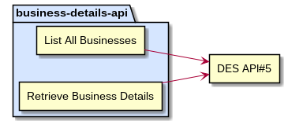
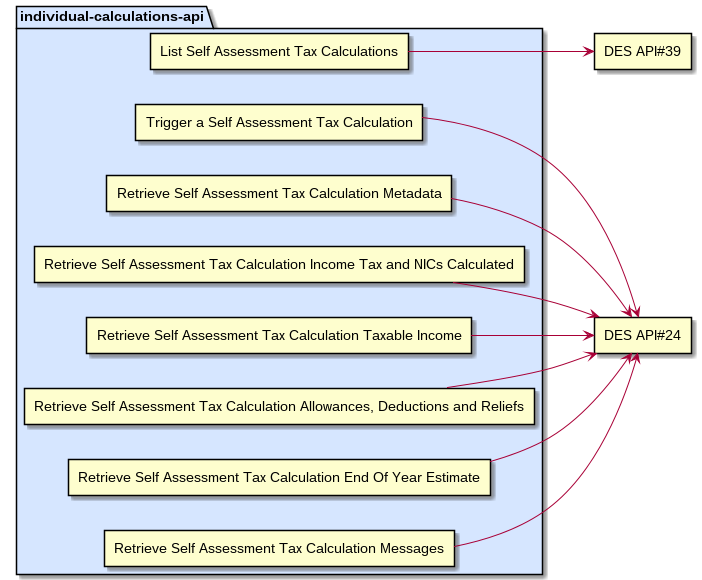
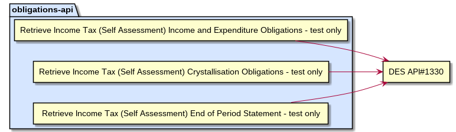

# MTD API Endpoint Mappings to DES

## Contents 
1. MTD-BISS-to-DES
1. MTD-BSAS-to-DES
1. MTD-CIS-deductions-to-DES
1. MTD-accounts-SA-to-DES
1. MTD-business-details-to-DES
1. MTD-ind-calculations-to-DES
1. MTD-ind-d-to-DES
1. MTD-ind-deductions-to-DES
1. MTD-ind-expenses-to-DES
1. MTD-ind-income-rcvd-to-DES
1. MTD-ind-losses-to-DES
1. MTD-ind-reliefs-to-DES
1. MTD-ind-state-benefits-to-DES
1. MTD-obligations-DES
1. MTD-self-assessment-to-DES

## MTD-BISS-to-DES

## MTD-BSAS-to-DES

## MTD-CIS-deductions-to-DES

## MTD-accounts-SA-to-DES

## MTD-business-details-to-DES

## MTD-ind-calculations-to-DES

## MTD-ind-d-to-DES

## MTD-ind-deductions-to-DES

## MTD-ind-expenses-to-DES

## MTD-ind-income-rcvd-to-DES

## MTD-ind-losses-to-DES

## MTD-ind-reliefs-to-DES

## MTD-ind-state-benefits-to-DES

## MTD-obligations-DES

## MTD-self-assessment-to-DES

