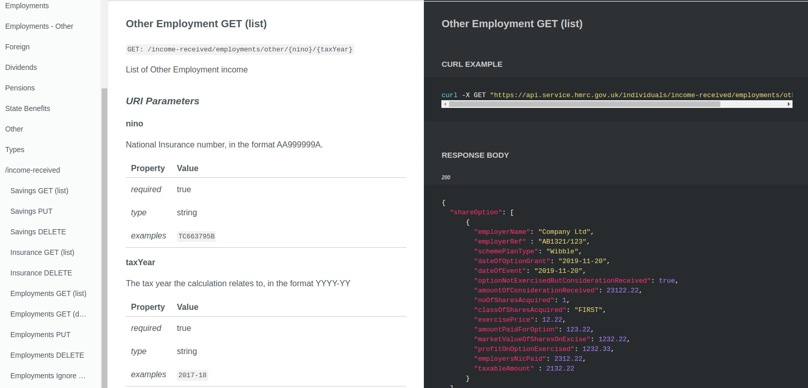

# api-architecture

Early stage RAML > HTML designs for APIs

## API Prototype Status

| API              | API Design Status | Status Updated |
|:------------------|:-----------------:|:------------:|
| business         |     | 2020-06-18 |
| business-details |     | 2020-06-18 |
| charges          |         | 2020-06-18 |
| deductions       |          | 2020-06-18 |    
| disclosures      |        | 2020-06-18 |    
| expenses         |          | 2020-06-18 |    
| income-received  |                   | 2020-06-18 |
| obligations      |     | 2020-06-18 |            
| reliefs          |          | 2020-06-18 |    
